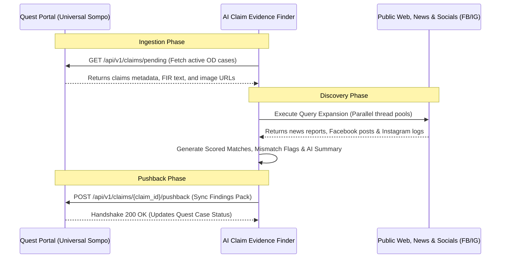

# Client Integration Requirements — Universal Sompo
**Document Version**: V1.0  
**Prepared For**: Universal Sompo Technical Team (Rajendra Chabra, Rakesh Dabholkar, Prakash Sharma)  
**System**: AI-Powered Claim Evidence Discovery & Investigation Assistant  

This document outlines the technical integrations, API specifications, database architectures, and network access requirements needed from Universal Sompo to transition the **AI Claim Evidence Finder** pilot dashboard into a production system.

---

## 1. Integration Architecture Overview

The system operates as a decision-support assistant alongside the **Quest Investigation Portal**. The integration flow consists of:
1. **Claims Ingestion (Pull)**: The assistant queries the Quest Portal API database to fetch claim facts, FIR text documents, and vehicle photos.
2. **Analysis**: The assistant executes query expansion, crawls public sources (news, Facebook, Instagram), runs visual checks, and generates an AI summary.
3. **Result Pushback (Push)**: The assistant pushes structured findings (relevance score, risk level, mismatch flags, AI summary, evidence links, and generated PDF/Excel reports) back to the Quest Portal callback handler.



---

## 2. Inbound Integration: Claims Ingestion API
Universal Sompo must expose an API endpoint that the AI Evidence Finder can query to fetch active Own Damage (OD) claims requiring RCU investigation.

### API Details: `GET /api/v1/claims/pending`
* **Protocol**: HTTPS (secured via API Key or OAuth2 Bearer Token)
* **Frequency**: Scheduled polling or triggered via webhook on Quest Portal claim registration.

#### Requested Response Payload Schema (JSON)
```json
{
  "status": "success",
  "data": [
    {
      "claim_id": "TP-RCU-UP-00517/2025",
      "policy_information": "POL-998877-2025",
      "accident_date_time": "2025-05-12T14:30:00",
      "loss_location": "near Kosi Kalan flyover, NH-2",
      "district_state": "Mathura, Uttar Pradesh",
      "police_station": "Kosi Kalan PS",
      "vehicle_numbers": "UP-85-AT-9988, HR-26-Z-1122",
      "vehicle_types": "Motorcycle, Truck",
      "parties_involved": "Ramesh Kumar (Rider), Suresh Singh (Truck Driver)",
      "injury_or_death": "Ramesh Kumar suffered head injuries, declared dead on arrival at District Hospital",
      "FIR_cause_narrative": "The motorcycle UP-85-AT-9988 ridden by Ramesh Kumar was hit from behind by a speeding truck bearing registration number HR-26-Z-1122 on NH-2 near Kosi Kalan. The rider Ramesh Kumar fell onto the road and sustained fatal head injuries. The truck driver Suresh Singh fled the spot leaving the vehicle.",
      "supporting_information": "Previous claim registered for vehicle UP-85-AT-9988 in 2023 for front bumper damage.",
      "image_urls": [
        "https://quest.universalsompo.com/assets/photos/UP-85-AT-9988_damage1.jpg"
      ]
    }
  ]
}
```

---

## 3. Outbound Integration: Quest Result Pushback API
Once an investigator completes a review on the dashboard, the findings must sync back to Universal Sompo's Quest database to update the claim transaction status.

### API Details: `POST /api/v1/claims/{claim_id}/pushback`
* **Endpoint Owner**: Universal Sompo (Quest Investigation Portal)
* **Auth**: Custom Client ID + Secret / Bearer Token

#### Pushback Payload Schema (JSON)
```json
{
  "claim_id": "TP-RCU-UP-00517/2025",
  "investigation_timestamp": "2026-07-07 09:45:00 UTC",
  "overall_score": 0.81,
  "risk_level": "HIGH REVIEW",
  "flagged_mismatches": ["cause", "time"],
  "mismatch_details": {
    "mismatch_cause": "FIR says truck hit bike, news says bike hit stationary truck.",
    "mismatch_location": "No discrepancies identified.",
    "mismatch_time": "Proximity violation: claim contradicts article event timestamps by more than 24 hours.",
    "mismatch_vehicle": "No discrepancies identified.",
    "mismatch_entity": "No discrepancies identified."
  },
  "ai_evidence_summary": "### Key Observations\n* Claim Ingested: TP-RCU-UP-00517/2025...\n### Relevant Findings\n* Discrepancy in accident cause...",
  "evidences": [
    {
      "rank": 1,
      "source": "News",
      "title": "Motorcyclist rams into stationary truck in Mathura",
      "url": "https://www.jagran.com/mathura/news.html",
      "score": 0.82,
      "why_relevant": "Same name and vehicle.",
      "publish_date": "2025-05-12"
    }
  ],
  "image_matches": [
    {
      "image_name": "UP-85-AT-9988_damage1.jpg",
      "status": "Reused - Stock Photo",
      "matched_url": "https://www.shutterstock.com/image-photo/damage-100",
      "why_matched": "Matches stock image visual fingerprint."
    }
  ],
  "export_paths": {
    "excel_pack_url": "https://sompo-rcu-assistant.corp/api/cases/TP-RCU-UP-00517_2025/export-excel",
    "pdf_report_url": "https://sompo-rcu-assistant.corp/api/cases/TP-RCU-UP-00517_2025/export-pdf"
  }
}
```

---

## 4. Network and Infrastructure Requirements

To support crawling and reverse visual matching, the Universal Sompo IT team must configure the hosting environment as follows:

1. **Internet Access Rules**:
   * The server hosting the AI Scorer must have outbound access to Google Search APIs, news portals (Jagran, Bhaskar, Amar Ujala), and social media search engines.
2. **Reverse Visual Search Access**:
   * Outbound network access to visual search API endpoints (Google Cloud Vision API or Custom Google Lens scraping proxies) to query claim photos.
3. **Internal API Routing**:
   * The Quest Portal server must be whitelisted to receive HTTP POST payloads from the assistant's static IP.
4. **Database Configuration**:
   * **Pilot Environment**: Utilizes a local SQLite database (`claims.db`).
   * **Production Environment**: Requires provisioning of a PostgreSQL schema.

---

## 5. Security & Statement of Responsibility

Universal Sompo must sign off on the platform's operational guidelines:

> **Statement of Responsibility**:
> The AI-Powered Claim Evidence Discovery & Investigation Assistant acts as an informational research aid. The software automates search query generation, crawls public web indexes, and highlights discrepancies (mismatch flags). The system does not make final claim decisions (approval/rejection) or issue fraud declarations. All final determinations and actions remain the sole responsibility of Universal Sompo's authorized RCU personnel.
